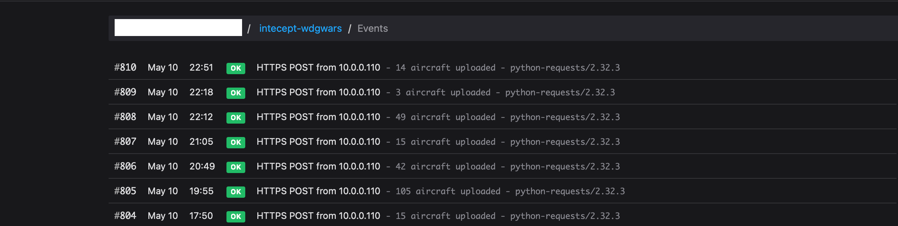

# intercept-wdgwars

**I AM NOT RESPONSIBLE FOR SHADOW BANS**

Exports live ADS-B aircraft data from an [intercept](https://github.com/smittix/intercept) PostgreSQL database into **dump1090-fa / readsb format** (`aircraft.json`), suitable for upload to [WatchDogsGo / wdgwars](https://github.com/LOCOSP/WatchDogsGo).

## How it works

The script polls `adsb_snapshots` in the intercept database on a configurable interval and writes a rolling-window snapshot of recently seen aircraft to both a session file and a fixed `aircraft.json` on each cycle. Session files align to intercept session boundaries — when a session ends, the session file is rewritten once with all aircraft seen across the full session before being uploaded to wdgwars.

## Requirements

- Python 3.9+
- A running [intercept](https://github.com/smittix/intercept) instance with PostgreSQL

```
pip install -r requirements.txt
```

## Setup

```bash
cp .env.sample .env
# edit .env with your database credentials and output preferences
python convert.py
```

## Modes

### Live (default)

Polls the database continuously and writes updated files on each refresh cycle:

```bash
python convert.py
```

### Historical

Generates session files for a full day (midnight to midnight in `AIRCRAFT_TIMEZONE`) from data already in the database. Useful for backfilling missed days or uploading past data to wdgwars:

```bash
python convert.py --date 2026-05-09
```

This queries `adsb_sessions` for all sessions overlapping the given date and writes one file per session. Sessions with no aircraft data are skipped.

## Configuration

All settings are via environment variables (or `.env`):

| Variable | Default | Description |
|---|---|---|
| `INTERCEPT_ADSB_DB_HOST` | `localhost` | PostgreSQL host |
| `INTERCEPT_ADSB_DB_PORT` | `5432` | PostgreSQL port |
| `INTERCEPT_ADSB_DB_NAME` | `intercept_adsb` | Database name |
| `INTERCEPT_ADSB_DB_USER` | `intercept` | Database user |
| `INTERCEPT_ADSB_DB_PASSWORD` | `intercept` | Database password |
| `AIRCRAFT_OUTPUT_DIR` | `./adsb_exports` | Directory for output files |
| `AIRCRAFT_FILE_PREFIX` | `aircraft` | Prefix for session filenames |
| `AIRCRAFT_REFRESH_SECONDS` | `60` | How often to write (seconds) — live mode only |
| `AIRCRAFT_MAX_AGE_SECONDS` | `60` | Rolling window for the live `aircraft.json` file — aircraft not seen within this many seconds are excluded from it. Does not affect session files |
| `AIRCRAFT_TIMEZONE` | `UTC` | IANA timezone for interpreting `--date` values and filenames (e.g. `America/New_York`) |
| `AIRCRAFT_MAX_ERRORS` | `10` | Exit after this many consecutive DB errors — live mode only |
| `WDGWARS_API_KEY` | _(unset)_ | API key from your wdgwars profile. Set to enable auto-upload after each write |
| `WDGWARS_UPLOAD_URL` | `https://wdgwars.pl/api/upload-csv` | Upload endpoint — default is correct for wdgwars.pl |
| `HEALTHCHECKS_URL` | _(unset)_ | healthchecks.io ping URL. Pinged on successful session upload; `/fail` on upload error. Set your check interval to match how often you rotate sessions (e.g. 24h + grace period) |
| `AIRCRAFT_WRITE_LATEST` | `true` | Also write a live `aircraft.json` — live mode only |
| `AIRCRAFT_LATEST_FILE` | `aircraft.json` | Name of the live file |

## Output

Session files are named after the intercept session start time: `aircraft_YYYYMMDD_HHMMSSTZ.json` in live mode, `aircraft_replay_YYYYMMDD_HHMMSSTZ.json` in historical mode. The timezone abbreviation reflects `AIRCRAFT_TIMEZONE`. Files rotate when intercept starts a new session. These timestamped session files are what you upload to wdgwars.

During a session, the session file is rewritten on every refresh cycle as a rolling snapshot (same window as `aircraft.json`). When the session ends, it is rewritten once more with all aircraft seen across the full session — one entry per ICAO hex, using each aircraft's most recent observed state — before being uploaded to wdgwars.

The live file (`aircraft.json`) is a rolling snapshot limited to `AIRCRAFT_MAX_AGE_SECONDS`, useful for tools that expect a fixed filename (e.g. tar1090, readsb). It is not needed for wdgwars uploads.

Session files pile up on disk and are not automatically pruned — set up a cron job or logrotate rule if disk space is a concern:

```
# delete session files older than 7 days
find /path/to/adsb_exports -name 'aircraft_*.json' -mtime +7 -delete
```

## Demo



```
DB: intercept@localhost:5432/intercept_adsb
Output dir: adsb_exports
Refresh: every 5.0 second(s)
Max aircraft age: 60 second(s)
Write latest file: True
Latest file: adsb_exports/aircraft.json
No active session, waiting...
No active session, waiting...
Writing session file: adsb_exports/aircraft_20260510_221933EDT.json

Uploaded aircraft_20260510_221933EDT.json: {'ok': True, 'imported': 7, 'captured': 0, 'updated': 0, 'duplicates': 0, 'no_gps': 0, 'bad_rows': 0, 'cooldown': 0, 'merged_samples': 0, 'total': 63105405}
```

## Notes

- Tested against intercept schema as of May 2026
- The `snapshot` JSONB column is used as a fallback if top-level columns are null
- `messages` count in session files is scoped to the session window; in the live `aircraft.json` it reflects the total row count of `adsb_messages`
